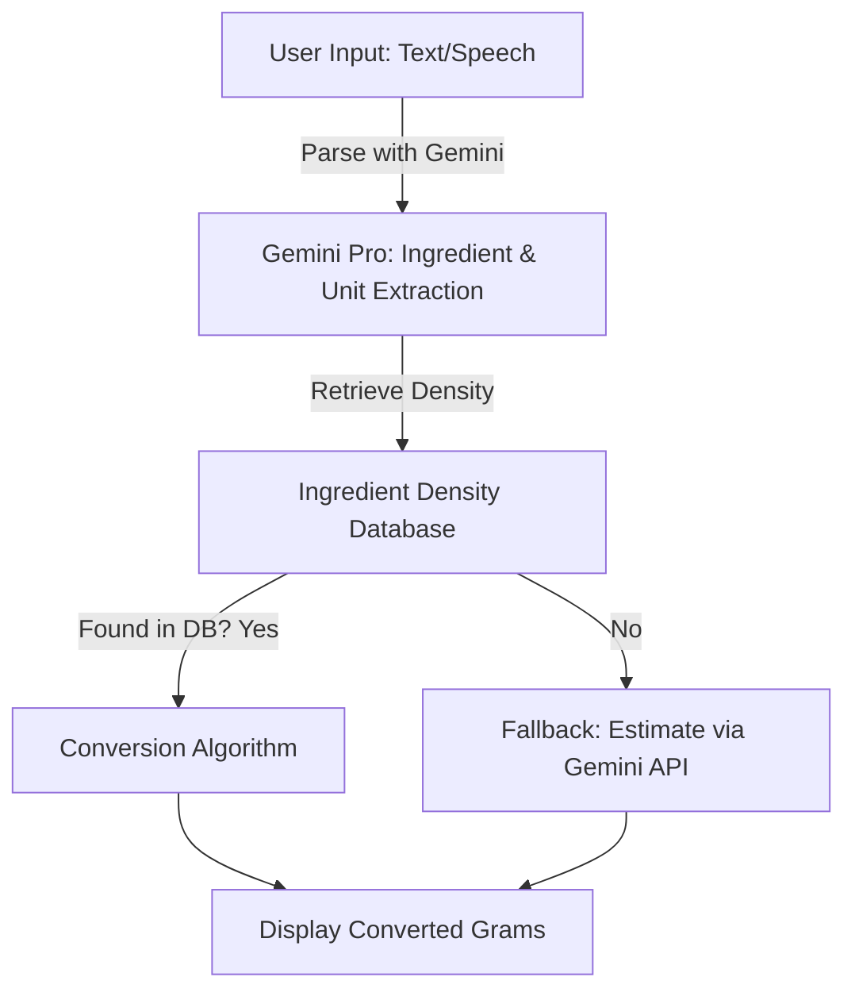

# precisebake_backend
Backend for Precisebake

PreciseBake - AI-Powered Recipe Measurement Converter

Welcome to PreciseBake, an AI-enhanced tool that ensures baking precision by converting recipe measurements from volume-based to weight-based units, improving consistency and accuracy in baking.

🌟 Quick Introduction

Many online recipes list ingredients using imprecise volume measurements like cups or spoons, which can lead to inconsistent results. PreciseBake solves this by converting these measurements into grams using a database of ingredient densities, real-time conversions, and AI-powered estimations for missing values.

✨ Features

✅ AI-Powered Measurement Conversion – Converts cups, spoons, ounces, and other units into grams accurately.

✅ Ingredient Database Lookup – Uses a PostgreSQL database to retrieve precise ingredient densities.

✅ Google Gemini API Integration – Provides intelligent estimations when ingredient data is unavailable.

✅ Speech-to-Text Input – Dictate ingredients and let AI process them instantly.

✅ Manual Text Input – Type out recipe ingredients and receive precise conversions.

🛠️ Tech Stack & Tools Used
| Component            | Technology              |
|----------------------|------------------------|
| **Backend**         | Flask (Python)          |
| **Database**        | PostgreSQL              |
| **AI API**         | Google Gemini API       |
| **Frontend Framework** | React.js, Tailwind CSS |
| **Speech Recognition** | Web Speech API (JavaScript) |

🔢 Measurement Handling
PreciseBake supports conversions for various units:

| Unit                  | Conversion Method                     |
|-----------------------|--------------------------------------|
| **Cups**             | Database lookup for density (grams per cup) |
| **Tablespoons (tbsp)** | Database lookup (grams per tbsp)    |
| **Teaspoons (tsp)**   | Database lookup (grams per tsp)     |
| **Ounces (oz)**      | Direct weight conversion            |
| **Pounds (lbs)**     | Direct weight conversion            |
| **Fluid Ounces (fl oz)** | Density-based conversion         |
| **Milliliters (ml)** | Density-based conversion            |
| **Liters (L)**       | Density-based conversion            |
| **Cloves (garlic, etc.)** | Fixed weight assumptions       |
| **Handful, Pinch, Dash** | Approximate fixed weights       |

📋 Limitations & Future Improvements

⚠️ Current Limitations

❌ Not all ingredients are available in the database; Gemini API fallback reliance is required for missing entries.

❌ Some units (like "a handful") require approximation rather than exact conversion.

❌ Image-based volume estimation is still under development.

🙌 Credits & Acknowledgments

Developed by [BitCrusaders] as part of the GDG On Campus Solution Challenge.

Special thanks to:

[Harsha A S] – Backend development, database management.

[Vahin Raj] – Frontend UI/UX, React + Tailwind integration.

Google Developer Tools – For providing the AI-powered API that enhances the solution.

Open Source Community - For all the guidance and debugging resources.

Built with ☕ and a lot of debugging!

